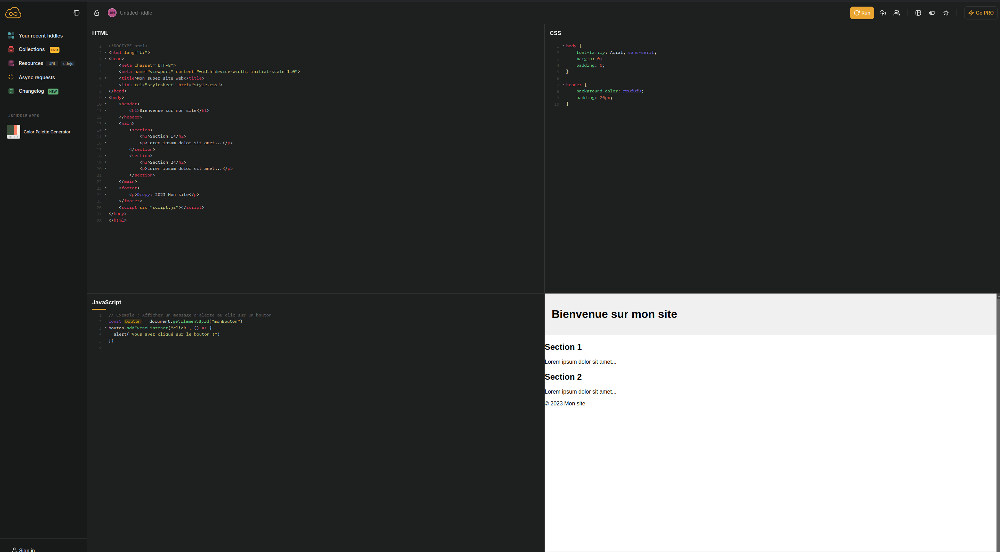

# Workshop IA : En quoi ChatGPT, Gemini et les outils de génération d’IA peuvent-ils nous permettre de mieux apprendre ?

## Objectif
L'objectif de cette activité est de comprendre comment les outils de génération d'IA peuvent nous permettre d'apprendre vite à faire les choses bien et rapidement.  
Penchons-nous sur un thème et un objectif précis pour mieux comprendre le sujet.

## Création d'un site web
Pour cette activité, nous allons chercher à créer un site web vitrine qui présente le jeu vidéo de notre choix.

### Un site web vitrine ?
On dit d'un site qu'il est une vitrine lorsqu'il présente un produit ou un service mais ne le propose pas directement. Voici quelques exemples dans le domaine du jeu vidéo :
- [Cyberpunk 2077](https://www.cyberpunk.net/fr/fr/)
- [The Witcher](https://thewitcher.com/fr/)
- [Caravan Sandwich](https://caravansandwitch.com/fr)
- [Call of Duty](https://www.callofduty.com/fr/blackops6)
- [Celeste](https://exok.com/games/celeste/)

Cette liste est bien sûr non exhaustive, et il en existe des milliers d'autres. Elle sert principalement à vous donner des idées et des exemples de ce que l'on peut réaliser.

### Support de développement

En support, nous allons utiliser un outil de développement web en ligne, [jsfiddle](https://jsfiddle.net/). C'est un outil qui permet de créer des sites web en ligne et de les partager facilement. Voici rapidement un aperçu de l'interface :

L'interface est divisée en 4 parties :
- En haut à gauche : l'éditeur de code HTML
- En haut à droite : l'éditeur de code CSS
- En bas à gauche : l'éditeur de code JS
- En bas à droite : la fenêtre de rendu du site web

### Les outils
Maintenant que nous avons un support de développement, nous allons utiliser des outils de génération d'IA pour nous aider à créer notre site web.  
Voici quelques exemples d'outils que nous pourrions utiliser :
- [ChatGPT](https://chat.openai.com/)
- [Gemini](https://gemini.openai.com/)
- [DALL-E](https://openai.com/research/dall-e/)
- [Copilot](https://copilot.microsoft.com/onboarding)
- [Bing Image Generator](https://www.bing.com/images/create/)

Encore une fois, cette liste est non exhaustive, et il en existe bien d'autres. Vous êtes libre d'utiliser les outils que vous voulez si vous êtes à l'aise avec eux.

### Conseils de réalisation

Vous l'avez compris, l'un des buts de cette activité est de vous faire apprendre le web à travers l'utilisation d'IA.  
Voici quelques conseils pour correctement utiliser les outils de génération d'IA :

- **Leur demander des explications plutôt que des résultats** : Les outils de génération d'IA sont très puissants, mais ils ne sont pas parfaits. Lors de votre activité, ils hallucineront probablement. Comprendre comment le code fonctionne est plus important que le résultat final.
- **Fractionner vos demandes en plusieurs étapes** : Demander à un outil de générer un site web complet est une tâche très complexe. Fractionner votre demande en plusieurs étapes plus simples est une bonne pratique.
    - Par exemple, demander à un outil de générer le code HTML, puis le CSS, puis le JS. Ou demander de générer le squelette du site, puis les images, puis le texte, etc.
- **Ne pas hésiter à demander de l'aide** : Si vous êtes bloqué, n'hésitez pas à demander de l'aide à vos camarades ou à votre formateur.  
